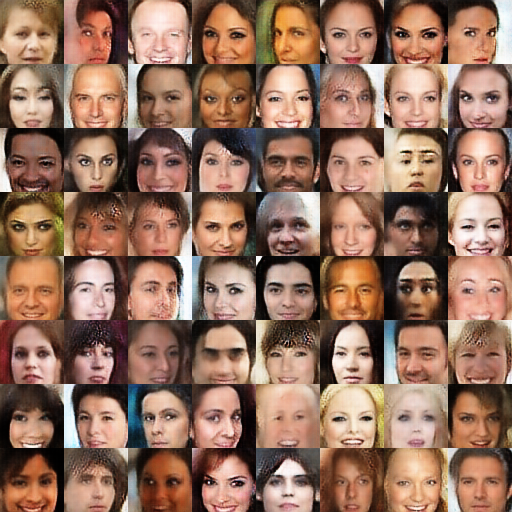

# GAN-Collections
  A implement of GAN-collection for tensorflow version. WGAN, WGAN_GP, LSGAN, VAE_GAN, BEGAN, EBGAN etc. More GAN models will be added to this repo. 

# Requirements

  - tensorflow 1.3.0

  - python2.7 or python3.6

  - numpy 1.13.*

  - scipy 0.17.0~ 0.19.1
 
# Usages

  (1)download this repo to your own directory
  
    $ git clone https://github.com/nnUyi/GAN-Collections.git
    $ cd GAN-Collections
    
  (2)download celebA dataset and store it in the data directory(directory named **data**)
      
   - celebA datasets is cropping into **64*64 size** with *.png or *jpg format, this repo read image format data as input.
      
  (3)training
    
    #you can run any gan models using main_**gan_type** like python main_wgan.py --is_training=True
    $ python main_**gan_type**.py --is_training=True 
    #example
    $ python main_vaegan.py --is_training=True 
  
  (4)testing
    
   - Anyway, in this repo, testing processing is taken during training, It samples the training results to the sample(named sample) directory, and stores session in the checkpoint(named checkpoint) directory.

# Experimental Results
  

  
  The experimental results is produced by BEGAN after 15 epoches training, we can clearly see that, BEGAN is stable. During training process, no collapses happend.
  
# Contacts

  Email:computerscienceyyz@163.com, Thank you for contacting if you find something wrong or if you have some problems!!!
